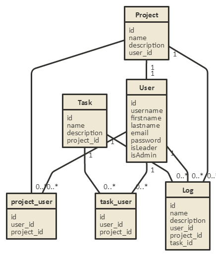
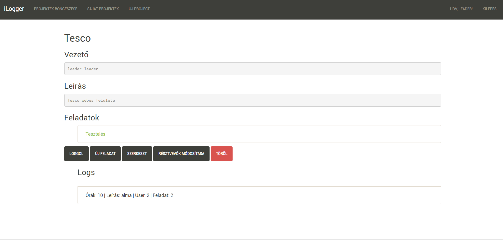

# Munkaidő nyilvántartó

### Telepítés
 - git clone
 - npm i 
 - admin belépés: admin@admin.hu:admin
 - expressadmin: a:aaAA11

### Funkcionális követelmények:
- Fejlesztőként szeretnék tudni bejelentkezni az oldalra
- Fejlesztőként szeretném a hozzám rendelt projekteket, taskokat megtekinteni.
- Fejlesztőként szeretnék a hozzám rendelt taskokhoz időt loggolni.
- Fejlesztőként szeretném a loggolt időimet megtekinteni.<br><br>
- Projektmenedzserként szeretnék tudni bejelentkezni az oldalra
- Projektmenedzserként szeretnék projektet létrehozni.
- Projektmenedzserként szeretném a saját projektjeimet törölni, módosítani.
- Projektmenedzserként szeretnék a saját projektjeimhez taskokat létrehozni, módosítani, törölni.
- Projektmenedzserként szeretném a projektjeimhez loggolt időket megtekinteni.
- Projektmenedzserként szeretnék projektjeimhez, és azok taskjaihoz fejlesztőket hozzárendelni, illetve törölni.
- Projektmenedzserként szeretnék a projekthez időt loggolni.<br><br>
- Adminként szeretnék tudni bejelentkezni az oldalra
- Adminként szeretnék felhasználókat hozzáadni,törölni.

### Nem funkcionális követelmények:
- Felhasználóbarát, ergonomikus elrendezés és kinézet.
- Gyors, megbízható működés.
- Biztonságos működés: jelszavak tárolása, funkciókhoz való hozzáférés.


###Szakterületi fogalomjegyzék

**Task:** Elvégzendó feladat
**Log:** Bejegyzés a munkáról

###Használatieset-modell, funkcionális követelmények

**Vendég**: Csak a publikus oldalakat éri el

*	Főoldal
*   Belépés

**Bejelentkezett felhasználó**: A publikus oldalak elérésén felül egyéb funkciókhoz is hozzáfér.

*	Projektek böngészése
*	Taskok megtekintése
*	Idő logolása

**Projekt vezető**: Több funció elérése a felhasználón felül

*	Projektek létrehozás
*	Taskok létrehozása
*	Felhasználók rendelése projekt, taskokhoz.

**Admin**: Hozzáadhat felhasználókat

*	Felhasználó hozzáadása


### Használatieset-diagram

```
#direction: right
[<actor>vendég] - [<usecase>főoldal]
[<actor>admin] - [<usecase>Felhasználó hozzáadása]
[<actor>admin] --> [<actor>vendég]
[<actor>felhasználó] - [<usecase>projektek böngészése]
[<actor>felhasználó] - [<usecase>feladatok böngészése]
[<actor>felhasználó] --> [<actor>vendég]
[<actor>Projekt vezető] --> [<actor>felhasználó]
[<actor>felhasználó] - [<usecase>bejelentkezés]
[<actor>felhasználó] - [<usecase>kijelentkezés]
[<actor>Projekt vezető] - [<usecase>új projekt hozzáadása]
[<actor>Projekt vezető] - [<usecase>saját projekt kezelése]
[<usecase>saját projekt kezelése] <<extends>><-- [<usecase>Feladat hozzáadása]
[<usecase>saját projekt kezelése] <<extends>><-- [<usecase>Feladat eltávoliítása]
[<usecase>saját projekt kezelése] <<extends>><-- [<usecase>Felhasználó hozzárendelése]
[<usecase>saját projekt kezelése] <<extends>><-- [<usecase>Felhasználó eltávolítása]
[<usecase>saját projekt kezelése] <<extends>><-- [<usecase>Projekt tölése]
```


### Folyamatok meghatározása


- Projekt vezető
    + új projekt felvételének folyamata

        ```
       #direction: right
        [<start>start] -> [<state>új projekt felvétele]
        [<state>új projekt felvétele] -> [<choice>megfelelő?]
        [<choice>megfelelő?] nem-> [<state>új projekt felvétele]
        [<choice>megfelelő?] igen-> [<end>end]
        ```
    
        

    + bejelentkezés folyamata

        ```
        #direction: right
        [<start>start] -> [<state>főoldal]
        [<state>főoldal] -> [<state>bejelentkezés]
        [<state>bejelentkezés] -> [<choice>sikeres?]
        [<choice>sikeres?] nem-> [<state>bejelentkezés]
        [<choice>sikeres?] igen-> [<end>end]
    
        ```

        

    + felhasználó hozzárendelése projekthez folyamata

        ```
        #direction: right
        [<start>start] -> [<state>főoldal]
        [<state>főoldal] -> [<state>Saját projektek]
        [<state>Saját projektek] -> [<state>Projekt választása]
        [<state>Projekt választása]-> [<state>Résztvevők módosítása]
        [<state>Résztvevők módosítása]-> [<state>Új résztvevő]
    	[<state>Új résztvevő]-> [<state>hozzáadás]
        [<state>hozzáadás] -> [<end>end]
    
        ```

                

        

### Sitemap

Publikus:

- Főoldal
- Belépés


Felhasználó

- Kilépés
- Projektek böngészése
    + Feladatok böngészése
        + Logok böngészése
        + Idő logolása
    + Logok böngészése
- Felhasználóhoz rendelt projektek böngészése
    + Idő logolása        

Projektvezető 

- Új projekt hozzáadása    
- Saját projektek böngészése
    + Projekt törlése
    + Feladat megtekintése
         + Résztvevők szerkesztése
            + Feladhoz rendelése
            + Feladatról eltávolítás
    + Feladat létrehozása
    + Feladat törlése
    + Résztvevők szerkesztése
        + Hozzárendelés
        + Eltávolítás

Admin

- Felhasználó hozzáadása        

### Végpontok

- `GET /`: főoldal
- `GET /login`: bejelentkező oldal
- `POST /login`: bejelentkezési adatok felküldése
- `GET /projects/create`: Projekt létrehozása
- `POST /projects/create`: Projekt adatok felküldése
- `POST /projects/:id/create`: Feladat adatok felküldése
- `GET /projects/:id/create`: Feladat létrehozása
- `GET /projects/:id/edit`: Projekt szerkesztése
- `POST /projects/:id/edit`: Projekt adatok felküldése
- `GET /projects/:id/delete`: Projekt törlése
- `GET /projects/:id/users`: Projekthez rendelt felhasználók
- `GET /projects/:id/users/add`: Projekthez felhasználó hozzáadása
- `GET /projects/:id/users/add/:id2`: Hozzárendelt felhasználó adatok felküldése
- `GET /projects/:id/users/:id2/delete`: Hozzárendelt felhasználó eltávolítása a projektről
- `GET /projects/:id/:id2/users`: Feladathoz rendelt felhasználók
- `GET /projects/:id/:id3/users/add`: Feladathoz felhasználó hozzáadása
- `GET /projects/:id/:id3/users/add/:id2`: Hozzárendelt felhasználó adatok felküldése
- `GET /projects/:id/:id3/users/:id2/delete`: Hozzárendelt felhasználó eltávolítása a feladatról
- `GET /projects/:id/log`: idő logolása projekthez
- `POST /projects/:id/log`: log felküldése
- `GET /projects/:id/:id2/log`: idő logolása projekthez
- `POST /projects/:id/:id2/log`: log felküldése
- `GET /projects/:id/:id2/edit`: Feladat szerkesztése
- `POST /projects/:id/:id2/edit`: Feladat adatok felküldése
- `GET /projects/:id/:id2/delete`: Feladat törlése
- `GET /projects/:id`: Projekt megjelenítése
- `GET /ownprojects`: Saját projektek megjelnítése(vezetőként)
- `GET /ownuserprojects`: Felhasználőként a hozzám rendelt projektek megtekintése
- `GET /projects/:id/:id2`: Feladat megjelenítése
- `GET /addUser`: Felhasználó hozzáadása, űrlap megjelítése
- `POST /addUser`: Felhasználó hozzáadása,adatok felküldése
- `GET /logout`: kijelentkezés


### Adatmodell

```
[User|
  id
  username
  firstname
  lastname
  email
  password
  isLeader
  isAdmin
]

[Task|
  id
  name
  description
  project_id
]

[Project|
  id
  name
  description
  user_id
]

[Log|
  id
  name
  description
  user_id
  project_id
  task_id
]

[project_user|
  id
  user_id
  project_id
]

[task_user|
  id
  user_id
  project_id
]


[User] 1 - 0..* [task_user]
[User] 1 - 0..* [project_user]
[Task] 1 - 0..* [task_user]
[Project] 1 - 0..* [project_user]
[Project] 1 - 1 [User]
[User] 1 - 0..* [Log]
[Task] 1 - 0..* [Log]
[Project] 1 - 0..* [Log]
```




### Designtervek (végső megvalósítás kinézete):

**Főoldal**


**Felhasználó hozzáadása oldal**


**Bejelentkező oldal**


**Saját project**


**Project oldal,logok, törlés**


**Project módosítása**


**Új feladat/task**


**Feladat/task módosítása**


**Logolás**


**Felhasználó hozzárendelése**


**Hozzárendelt felhasználók, felhasználó eltávolítása**


**Új projekt felvétele**


 
### Fejlesztőkörnyezet:

* Visual Studio Code
* Node
* Github


### Kliensoldali JavaScript :

## Project törlése ajax segítégével:
- Érintett fájlok:
    + resources/views/projectShow.njk
    + public/scripts/deleteProject.js
    + app/Http/routes.js
    + app/Http/Controllers/LogController.js/ajaxProjectDelete
-Működés: A törlés gomb megnyomására, a deleteProject.js-ben lévő javascript megjelenít egy megerősítő popupot, majd az ok gomb megnyomására elküld egy XMLHttpRequest-et az ajacProjectDelete controllernek, amely kitörli a megfelelő projektet, majd sikeres jelzést küld vissza, aminek hatására, a javascript átirányítja a felhasználót.  
