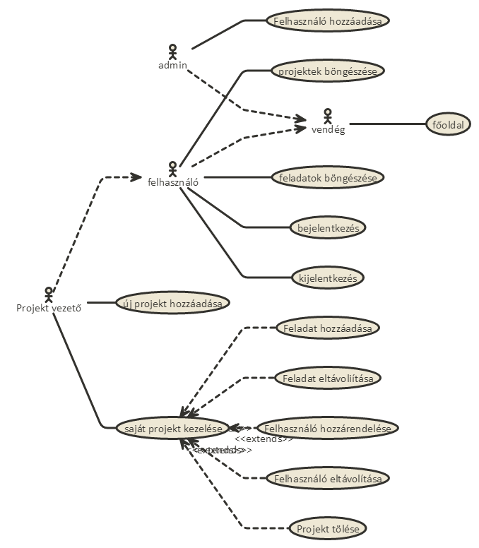

# Munkaidő nyilvántartó

### Telepítés
 - git clone
 - npm i 
 - admin belépés: admin@admin.hu:admin
 - expressadmin: a:aaAA11

### Funkcionális követelmények:
- Fejlesztőként szeretnék tudni bejelentkezni az oldalra
- Fejlesztőként szeretném a hozzám rendelt projekteket, taskokat megtekinteni.
- Fejlesztőként szeretnék a hozzám rendelt taskokhoz időt loggolni.
- Fejlesztőként szeretném a loggolt időimet megtekinteni.<br><br>
- Projektmenedzserként szeretnék tudni bejelentkezni az oldalra
- Projektmenedzserként szeretnék projektet létrehozni.
- Projektmenedzserként szeretném a saját projektjeimet törölni, módosítani.
- Projektmenedzserként szeretnék a saját projektjeimhez taskokat létrehozni, módosítani, törölni.
- Projektmenedzserként szeretném a projektjeimhez loggolt időket megtekinteni.
- Projektmenedzserként szeretnék projektjeimhez, és azok taskjaihoz fejlesztőket hozzárendelni, illetve törölni.
- Projektmenedzserként szeretnék a projekthez időt loggolni.<br><br>
- Adminként szeretnék tudni bejelentkezni az oldalra
- Adminként szeretnék felhasználókat hozzáadni,törölni.

### Nem funkcionális követelmények:
- Felhasználóbarát, ergonomikus elrendezés és kinézet.
- Gyors, megbízható működés.
- Biztonságos működés: jelszavak tárolása, funkciókhoz való hozzáférés.


###Szakterületi fogalomjegyzék

**Task:** Elvégzendó feladat
**Log:** Bejegyzés a munkáról

###Használatieset-modell, funkcionális követelmények

**Vendég**: Csak a publikus oldalakat éri el

*	Főoldal
*   Belépés

**Bejelentkezett felhasználó**: A publikus oldalak elérésén felül egyéb funkciókhoz is hozzáfér.

*	Projektek böngészése
*	Taskok megtekintése
*	Idő logolása

**Projekt vezető**: Több funció elérése a felhasználón felül

*	Projektek létrehozás
*	Taskok létrehozása
*	Felhasználók rendelése projekt, taskokhoz.

**Admin**: Hozzáadhat felhasználókat

*	Felhasználó hozzáadása


### Használatieset-diagram

```
#direction: right
[<actor>vendég] - [<usecase>főoldal]
[<actor>admin] - [<usecase>Felhasználó hozzáadása]
[<actor>admin] --> [<actor>vendég]
[<actor>felhasználó] - [<usecase>projektek böngészése]
[<actor>felhasználó] - [<usecase>feladatok böngészése]
[<actor>felhasználó] --> [<actor>vendég]
[<actor>Projekt vezető] --> [<actor>felhasználó]
[<actor>felhasználó] - [<usecase>bejelentkezés]
[<actor>felhasználó] - [<usecase>kijelentkezés]
[<actor>Projekt vezető] - [<usecase>új projekt hozzáadása]
[<actor>Projekt vezető] - [<usecase>saját projekt kezelése]
[<usecase>saját projekt kezelése] <<extends>><-- [<usecase>Feladat hozzáadása]
[<usecase>saját projekt kezelése] <<extends>><-- [<usecase>Feladat eltávoliítása]
[<usecase>saját projekt kezelése] <<extends>><-- [<usecase>Felhasználó hozzárendelése]
[<usecase>saját projekt kezelése] <<extends>><-- [<usecase>Felhasználó eltávolítása]
[<usecase>saját projekt kezelése] <<extends>><-- [<usecase>Projekt tölése]
```




### Folyamatok meghatározása


- Projekt vezető
    + új projekt felvételének folyamata

        ```
       #direction: right
        [<start>start] -> [<state>új projekt felvétele]
        [<state>új projekt felvétele] -> [<choice>megfelelő?]
        [<choice>megfelelő?] nem-> [<state>új projekt felvétele]
        [<choice>megfelelő?] igen-> [<end>end]
        ```
    
        

    + bejelentkezés folyamata

        ```
        #direction: right
        [<start>start] -> [<state>főoldal]
        [<state>főoldal] -> [<state>bejelentkezés]
        [<state>bejelentkezés] -> [<choice>sikeres?]
        [<choice>sikeres?] nem-> [<state>bejelentkezés]
        [<choice>sikeres?] igen-> [<end>end]
    
        ```

        

    + felhasználó hozzárendelése projekthez folyamata

        ```
        #direction: right
        [<start>start] -> [<state>főoldal]
        [<state>főoldal] -> [<state>Saját projektek]
        [<state>Saját projektek] -> [<state>Projekt választása]
        [<state>Projekt választása]-> [<state>Résztvevők módosítása]
        [<state>Résztvevők módosítása]-> [<state>Új résztvevő]
    	[<state>Új résztvevő]-> [<state>hozzáadás]
        [<state>hozzáadás] -> [<end>end]
    
        ```

                

        

### Sitemap

Publikus:

- Főoldal
- Belépés


Felhasználó

- Kilépés
- Projektek böngészése
    + Feladatok böngészése
        + Logok böngészése
        + Idő logolása
    + Logok böngészése
- Felhasználóhoz rendelt projektek böngészése
    + Idő logolása        

Projektvezető 

- Új projekt hozzáadása    
- Saját projektek böngészése
    + Projekt törlése
    + Feladat megtekintése
         + Résztvevők szerkesztése
            + Feladhoz rendelése
            + Feladatról eltávolítás
    + Feladat létrehozása
    + Feladat törlése
    + Résztvevők szerkesztése
        + Hozzárendelés
        + Eltávolítás

Admin

- Felhasználó hozzáadása        

### Végpontok

- `GET /`: főoldal
- `GET /login`: bejelentkező oldal
- `POST /login`: bejelentkezési adatok felküldése
- `GET /projects/create`: Projekt létrehozása
- `POST /projects/create`: Projekt adatok felküldése
- `POST /projects/:id/create`: Feladat adatok felküldése
- `GET /projects/:id/create`: Feladat létrehozása
- `GET /projects/:id/edit`: Projekt szerkesztése
- `POST /projects/:id/edit`: Projekt adatok felküldése
- `GET /projects/:id/delete`: Projekt törlése
- `GET /projects/:id/users`: Projekthez rendelt felhasználók
- `GET /projects/:id/users/add`: Projekthez felhasználó hozzáadása
- `GET /projects/:id/users/add/:id2`: Hozzárendelt felhasználó adatok felküldése
- `GET /projects/:id/users/:id2/delete`: Hozzárendelt felhasználó eltávolítása a projektről
- `GET /projects/:id/:id2/users`: Feladathoz rendelt felhasználók
- `GET /projects/:id/:id3/users/add`: Feladathoz felhasználó hozzáadása
- `GET /projects/:id/:id3/users/add/:id2`: Hozzárendelt felhasználó adatok felküldése
- `GET /projects/:id/:id3/users/:id2/delete`: Hozzárendelt felhasználó eltávolítása a feladatról
- `GET /projects/:id/log`: idő logolása projekthez
- `POST /projects/:id/log`: log felküldése
- `GET /projects/:id/:id2/log`: idő logolása projekthez
- `POST /projects/:id/:id2/log`: log felküldése
- `GET /projects/:id/:id2/edit`: Feladat szerkesztése
- `POST /projects/:id/:id2/edit`: Feladat adatok felküldése
- `GET /projects/:id/:id2/delete`: Feladat törlése
- `GET /projects/:id`: Projekt megjelenítése
- `GET /ownprojects`: Saját projektek megjelnítése(vezetőként)
- `GET /ownuserprojects`: Felhasználőként a hozzám rendelt projektek megtekintése
- `GET /projects/:id/:id2`: Feladat megjelenítése
- `GET /addUser`: Felhasználó hozzáadása, űrlap megjelítése
- `POST /addUser`: Felhasználó hozzáadása,adatok felküldése
- `GET /logout`: kijelentkezés


### Adatmodell

```
[User|
  id
  username
  firstname
  lastname
  email
  password
  isLeader
  isAdmin
]

[Task|
  id
  name
  description
  project_id
]

[Project|
  id
  name
  description
  user_id
]

[Log|
  id
  name
  description
  user_id
  project_id
  task_id
]

[project_user|
  id
  user_id
  project_id
]

[task_user|
  id
  user_id
  project_id
]


[User] 1 - 0..* [task_user]
[User] 1 - 0..* [project_user]
[Task] 1 - 0..* [task_user]
[Project] 1 - 0..* [project_user]
[Project] 1 - 1 [User]
[User] 1 - 0..* [Log]
[Task] 1 - 0..* [Log]
[Project] 1 - 0..* [Log]
```


### Designtervek (végső megvalósítás kinézete):

**Főoldal**


**Felhasználó hozzáadása oldal**


**Bejelentkező oldal**


**Saját project**


**Project oldal,logok, törlés**


**Project módosítása**


**Új feladat/task**


**Feladat/task módosítása**


**Logolás**


**Felhasználó hozzárendelése**


**Hozzárendelt felhasználók, felhasználó eltávolítása**


**Új projekt felvétele**


 
### Fejlesztőkörnyezet:

* Visual Studio Code
* Node
* Github


### Kliensoldali JavaScript :

#### Project törlése megerősítés után ajax segítégével:
- Érintett fájlok:
    + resources/views/projectShow.njk
    + public/scripts/deleteProject.js
    + app/Http/routes.js
    + app/Http/Controllers/LogController.js/ajaxProjectDelete
- Működés: A törlés gomb megnyomására, a deleteProject.js-ben lévő javascript megjelenít egy megerősítő popupot, majd az ok gomb megnyomására elküld egy XMLHttpRequest-et az ajaxProjectDelete controllernek, amely kitörli a megfelelő projektet, majd sikeres jelzést küld vissza, aminek hatására, a javascript átirányítja a felhasználót.  

#### Task törlése megerősítés után ajax segítégével:
- Érintett fájlok:
    + resources/views/tasktShow.njk
    + public/scripts/deleteTask.js
    + app/Http/routes.js
    + app/Http/Controllers/LogController.js/ajaxTaskDelete
- Működés: A törlés gomb megnyomására, a deleteTask.js-ben lévő javascript megjelenít egy megerősítő popupot, majd az ok gomb megnyomására elküld egy XMLHttpRequest-et az ajaxProjectDelete controllernek, amely kitörli a megfelelő projektet, majd sikeres jelzést küld vissza, aminek hatására, a javascript átirányítja a felhasználót. 

#### Hozzárendelés task/project-hez ajax segítségével:
- Érintett fájlok:
    + resources/views/projectAddUsers.njk
    + resources/views/taskAddUser.njk
    + public/scripts/assignUser.js
    + app/Http/routes.js
    + app/Http/Controllers/LogController.js/ajaxTaskAddUser
    + app/Http/Controllers/LogController.js/ajaxProjectAddUser
- Működés: A hozzáadás gomb megnyomására, az assignUser-ben lévő javascript egy XMLHttpRequest-et küld az ajaxTaskAddUser/ajaxProjectAddUser controllernek, amely hozzárendeli a megfelelő dolgozót a project/task-hoz, majd sikeres jelzést küld vissza, aminek hatására, a javascript frissíti a DOM-ot, eltávolítja a hozzáadott dolgozót a listáról.

#### Dolgozó eltávolítása task/project-ről ajax segítségével:
- Érintett fájlok:
    + resources/views/projectUsers.njk
    + resources/views/taskUsers.njk
    + public/scripts/unassignUser.js
    + app/Http/routes.js
    + app/Http/Controllers/LogController.js/ajaxTaskDeleteUser
    + app/Http/Controllers/LogController.js/ajaxProjectDeleteUser
- Működés: A törlés gomb megnyomására, az assignUser-ben lévő javascript egy XMLHttpRequest-et küld az ajaxTaskDeleteUser/ajaxProjectDeleteUser controllernek, amely hozzárendeli a megfelelp dolgozót a project/task-hoz, majd sikeres jelzést küld vissza, aminek hatására, a javascript frissíti a DOM-ot, eltávolítja a törölt dolgozót a listáról.
- Szekvenciadiagram(project-ről):

        WebSequenceDiagram

        ```
        HTMLPage->Javascript: onclick esemény
        Javascript->XMLHttpRequest:<<létrehoz>>
        Javascript->XMLHttpRequest:url=/ajax/projects/:id/users/:id2/delete
        Javascript->XMLHttpRequest:callback függvény beállítása
        XMLHttpRequest->ajaxProjectDeleteUser:delete /ajax/projects/:id/users/:id2/delete
        ajaxProjectDeleteUser->XMLHttpRequest:Siker
        XMLHttpRequest->Javascript:Callback függvény hívása
        Javascript->HTMLPage: DOM frissítése
    
        ```

 

#### Bejelentkezés modal-al ajax segítségével:
- Érintett fájlok:
    + resources/views/main.njk
    + resources/views/layout.njk
    + public/scripts/popup_login.js
    + app/Http/routes.js
    + app/Http/Controllers/UserController.js/ajaxLogin
- Működés: A bejelntkezés gomb megnyomására, a popup_login.js-ben lévő javascript megjelenít egy modalt, amely tartlamazza a belépés form-ját, a küldés gomb megnyomására elküld egy XMLHttpRequest-et az ajaxLogin controllernek, amely megpróbálja beléptteni a felhasználót, és sikeres/sikertelen jelzést küld vissza attól függően, hogy sikerült-e. A javascript ennek hatására frissíti a DOM-ot, sikertelen jelzés esetén hobát jelez, sikeres esetén pedig bezárja a modal-t, és frissíti a navigációs menüt.   

#### Kliens oldali validálás bootsrap validator segítségével felhasználó hozzáadásánál:
- Érintett fájlok:
    + resources/views/register.njk
- Működés: Validálás bootsrap validator segítségével, az alábbi validálásokat tartalmazza:
    + Minden szükséges
    + Jelszó minimum 6 karakter
    + Jelsző megerősítésnek meg kell egyezni a jelszóval
    + Email-nek helyes fórmátumunak kell lennie.
- Ha ezek teljseülnek, aktívvá válik a küldés gomb.      

#### Logolás project/task-hoz modal és ajax segítségével:
- Érintett fájlok:
    + resources/views/projectShow.njk
    + resources/views/taskShow.njk
    + public/scripts/popup_log.js
    + app/Http/routes.js
    + app/Http/Controllers/LogController.js/ajaxTaskLog
    + app/Http/Controllers/LogController.js/ajaxProjectLog
- Működés: A Loggol gomb megnyomására, a popup_log.js-ben lévő javascript megjelenít egy modalt, amely tartlamazza a log form-ját, a küldés gomb megnyomására elküld egy XMLHttpRequest-et az ajaxTaskLog/ajaxProjectLog controllernek, amely hozzáadja az adatbázishoz a logot majd sikeres jelzést küld. A javascript ennek hatására frissíti a DOM-ot, bezárja a modalt és frissíti a logok listáját.


### Funkcionális tesztek:

- Selnium telepítése:
    + Firefox letöltése
    + Selenium IDE telepítése kiegészítőként: https://addons.mozilla.org/en-US/firefox/addon/selenium-ide/

- Tesztek futtatása:
    + 2 féle módszer:
        + Tesztek egyenként való importálása:
            + File/Open: Megnyitja a kiválasztott selenium tesztet.
        + Test Suite importálása:
            + File/Open New Test Suite : Ez megnyitja a test suitot, amely egy összefüggő tesztsorozatot tartalmaz.Egész test suite könnyen futtatható Actions/Play Entire Test Suite segítségével

- Test Suite tartalma, a teszt esetek külön fájlokban is megtalálhatók:
    + AdminLogin : Bejelentkezik admin felhasználóbal(Feltételez admin@admin.hu:admin felhasználót)
    + AdminAddUSer : Új felhasználó hozzáadása
    + Kilep : Kilép
    + LeaderLogin : Belépés vezetővel(Feltételez leader@leader.hu:leader felhasználót)
    + LeaderNewProject: Project létrehozása
    + LeaderNewTask: Task létrehozása(Feltételez Project123 projektet)
    + LeaderAssign(Feltételez legalább egy felhasználót, Project123 projektet,Task123 taskot): Hozzárendel egy dolgozót a task-hoz.
    + LeaderUnassign(Feltételez legalább egy felhasználót, Project123 projektet,Task123 taskot): Töröl egy dolgozót a task-ról.
    + LeaderAssignForWorkerTest(Feltételez legalább egy felhasználót, Project123 projektet,Task123 taskot): Hozzárendel egy felhasználót a worker teszthez.
    + WorkerLogin : Belépés dolgozóval(Feltételez worker@worker.hu:worker felhasználót)
    + WorkerLog:(Felttelezi hogy hozzávan rendelve Task123-hoz):Időt logol egy task-hoz.
- Helyes lefutás esetén hasonlót kell látnunk:
     


## Javítások első részhez:
- Autorizáció kiegészítése, ellenőrzése, hogy van.e joga az adott műelethez(Vezető,Admin-e).
- Átirányítások: Project,Task léterhozása után, nem a főoldalra, hanem a kreált task/project-hez visz.
- Task törlés javítása: Törlés eddig nem volt működőképes.
- Új végpont : - `GET /assignedTasks`: A dolgozóhoz rendelt taskokat tartalmazza.


